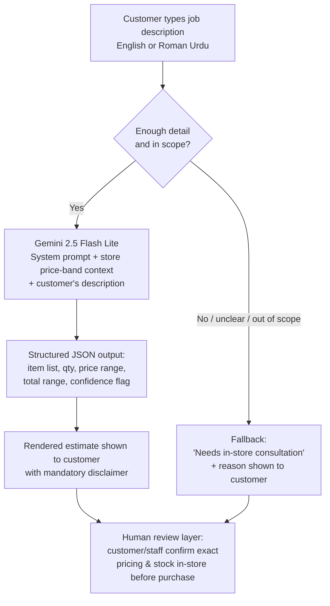

# AI Workflow Diagram — Instant Job Estimate

## Notes
- The branch at B is enforced inside the model's own instructions (the prompt requires it to self-assess before answering), not by separate application logic — this is documented as a limitation: a second, independent check would strengthen it.
- Every path — confident estimate or fallback — ends at the same human checkpoint (G). No output is ever treated as final pricing.
- The confidence flag (`high`/`low`) attached to every non-fallback estimate is a second, lighter-weight signal to the customer on top of the binary fallback gate.
